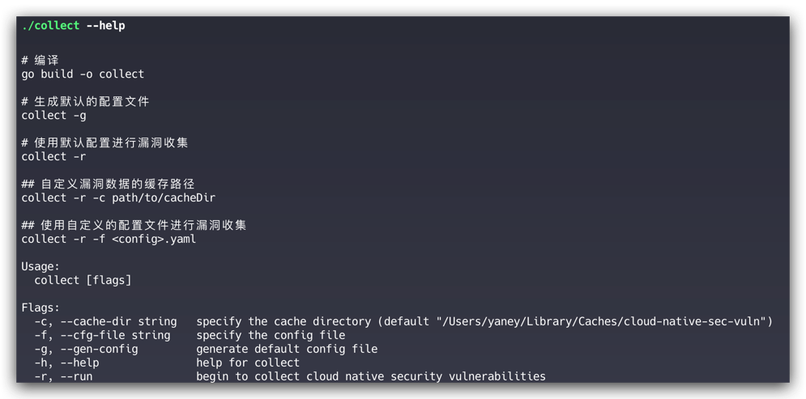
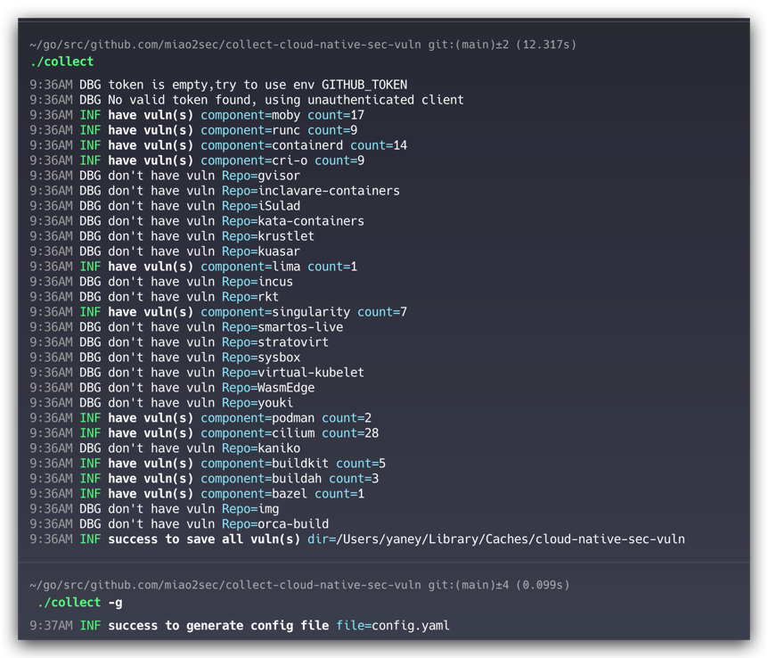
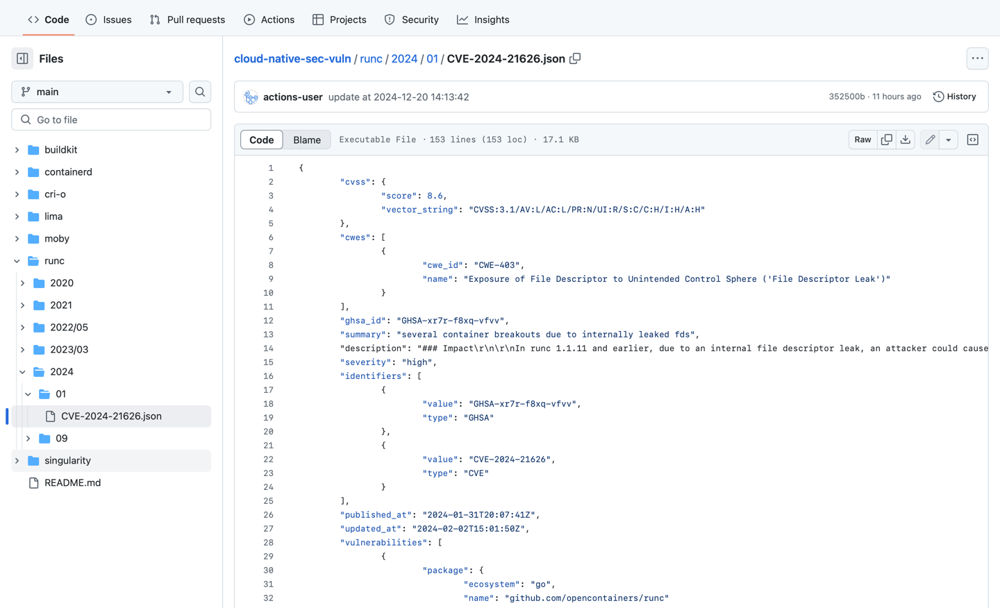

# collect-cloud-native-security-vuln: 云原生安全漏洞收集工具


[](https://goreportcard.com/report/github.com/miao2sec/collect-cloud-native-security-vuln)
[](https://app.fossa.com/projects/custom%2B37386%2Fgithub.com%2Fksoclabs%2Fkbom?ref=badge_shield)

collect-cloud-native-security-vuln 是一款用于收集云原生生态系统中各个组件安全漏洞的工具。



通过自动化方式，它能帮助你及时获取到相关项目的最新安全信息，以便采取相应的防护措施。



所有收集的 JSON 数据通过 Github Action ， 每 6 小时更新在仓库 [cloud-native-sec-vuln](https://github.com/miao2sec/cloud-native-sec-vuln) 中。



## 0x00 目录

- [快速开始](#0x01-快速开始)
- [功能特性](#0x02-功能特性)
- [配置说明](#0x03-配置说明)
- [组件支持](#0x04-组件支持)
- [贡献指南](#0x05-贡献指南)
- [许可证](#0x06-许可证)

## 0x01 快速开始

### 1.1 安装

1. 确保你的系统已安装 Go 环境，并克隆本项目到本地：
    ```bash
    git clone https://github.com/miao2sec/cloud-native-security-vuln.git
    ```
2. 编译并生成可执行文件
    ```bash
   cd cloud-native-security-vuln
   go build -o collect
    ```
### 1.2 使用

1. (使用默认配置)进行漏洞收集
    ```bash
    ./collect
    ```
2. 生成默认的配置文件
    ```bash
    ./collect -g
    ```
3. 自定义漏洞数据的缓存路径
    ```bash
    ./collect -r -c path/to/cacheDir
    ```

4. 使用自定义的配置文件进行漏洞收集
    ```bash
    ./collect -r -f <config>.yaml
    ```

## 0x02 功能特性

- 自动收集云原生生态系统中各个组件的安全漏洞信息。
- 支持自定义配置文件，灵活调整收集策略。
- 支持自定义缓存目录，随时查看漏洞数据。
- 支持多种命令行参数，方便用户操作。

## 0x03 配置说明

配置文件采用 YAML 格式，以下是一个示例配置：

```yaml
# token：GitHub API Token，用于访问 GitHub API
token: write-your-github-token
# cache_dir：漏洞数据存储目录
cache_dir: cloud-native-sec-vuln
# components：需要收集漏洞信息的组件列表，包括组件的 owner 和 repo。
components:
    - owner: moby
      repo: buildkit
    - owner: opencontainers
      repo: runc
```

## 0x04 组件支持

### 4.1 运行时组件

1. Docker (Moby)
2. runc
3. containerd
4. CRI-O
5. gVisor
6. inclavare-containers
7. iSulad
8. Kata Containers
9. Krustlet
10. Kuasar
11. Lima
12. LXC
13. rkt
14. Singularity
15. SmartOS
16. Stratovirt
17. Sysbox
18. Virtual Kubelet
19. WasmEdge
20. Youki
21. Podman

### 4.2 网络组件

1. Cilium

### 4.3 容器镜像构建

1. Kaniko
2. BuildKit
3. Buildah
4. Bazel
5. img
6. orca-build

### 4.4 服务网格

1. istio

## 0x05 贡献指南

欢迎各位同学参与本项目，共同完善云原生安全漏洞收集工具。以下是贡献指南：

1. Fork 本项目。
2. 创建您的特性分支。
    ```bash
    git checkout -b new-feature
    ```
3. 提交您的修改。
    ```bash
    git commit -am 'Add some feature'
    ```
4. 将您的修改推送到分支。
    ```bash
    git push origin new-feature
    ```
5. 提交 Pull Request。

## 0x06 许可证

本项目采用 MIT 许可证，详情请参阅 [LICENSE](./LICENSE) 文件。